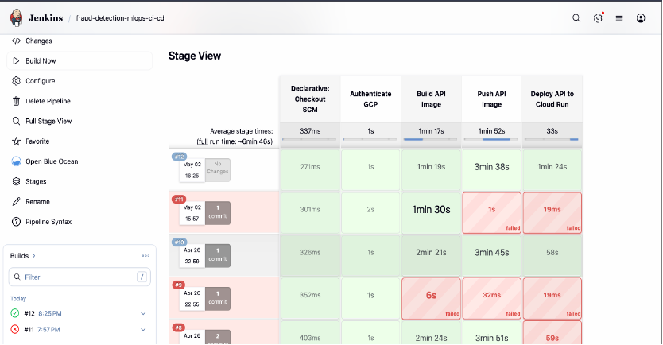
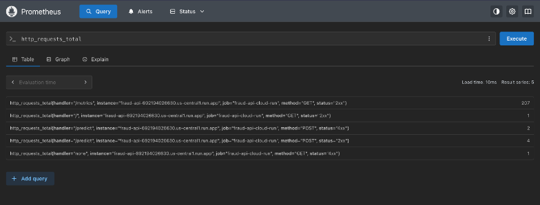
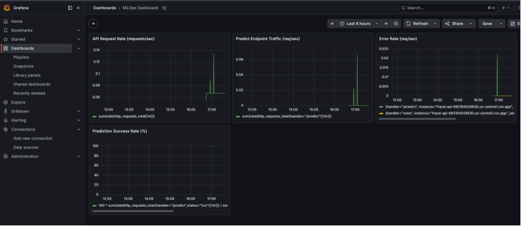

# MLOps Architecture – Fraud Detection System

This document showcases the architecture, workflow, and monitoring setup of an end-to-end event-driven MLOps pipeline built on Google Cloud Platform.

## Overview
- Event-driven retraining using GCS + Pub/Sub
- Serverless deployment using Cloud Run
- CI/CD pipeline using Jenkins + Docker
- Monitoring using Prometheus + Grafana

---

##  Architecture Diagram

(Refer to the main document: `mlops-architecture.docx`)

---

##  CI/CD Pipeline

---

## ☁️ Cloud Run Deployment

---

##  Prometheus Metrics

---

## Grafana Dashboard

---

##  Key Highlights

- Fully automated retraining pipeline
- Serverless architecture (Cloud Run)
- Real-time monitoring with custom metrics
- Production-style MLOps system

